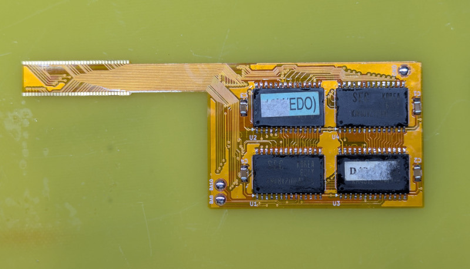
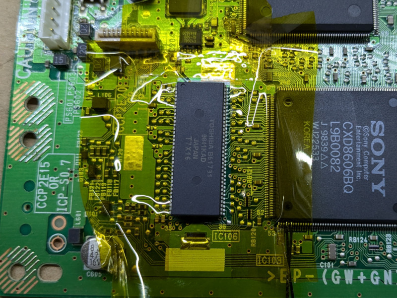
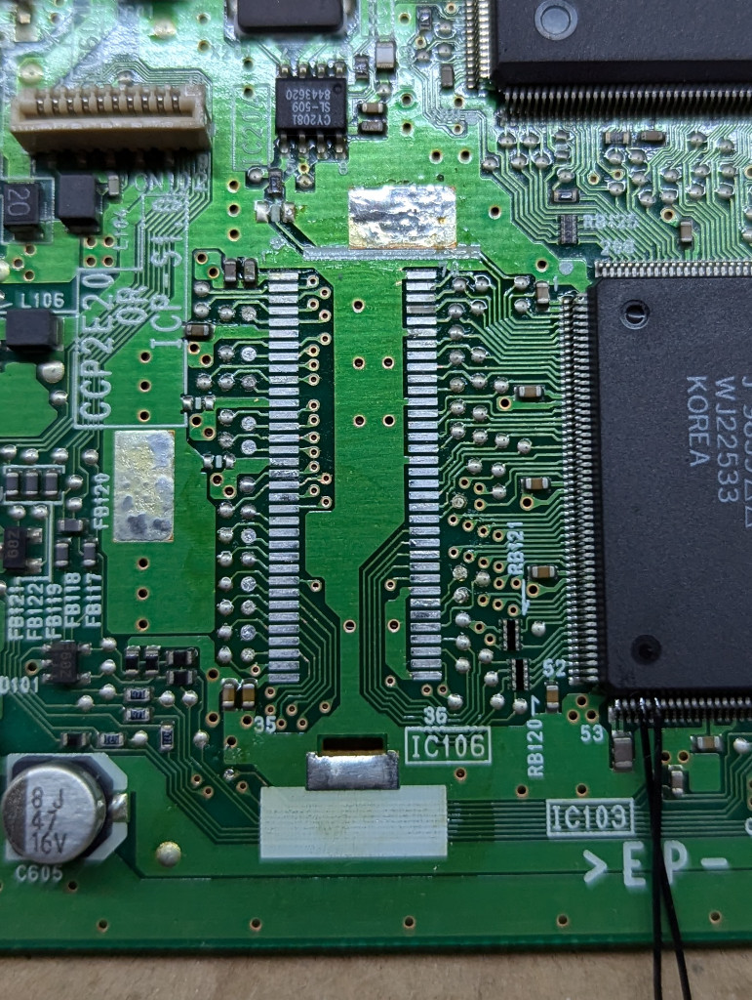
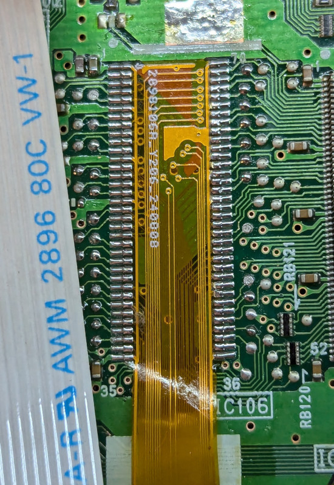
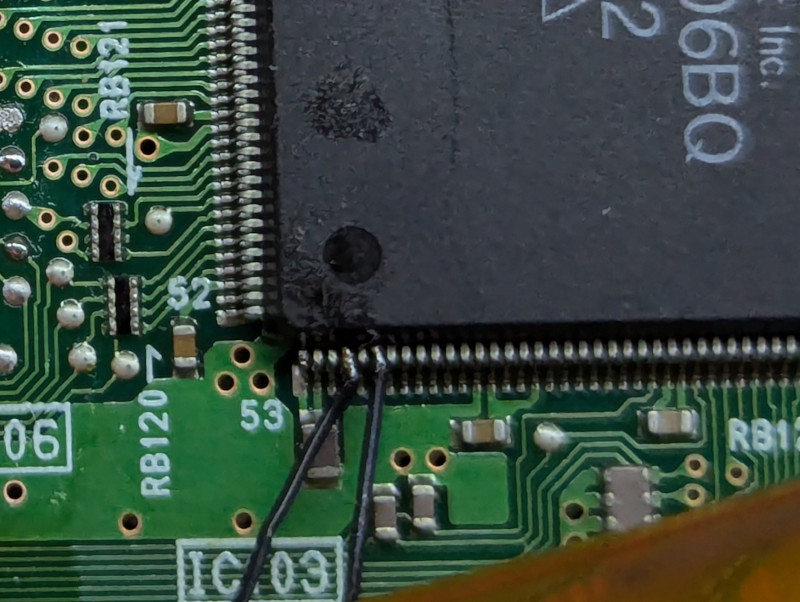
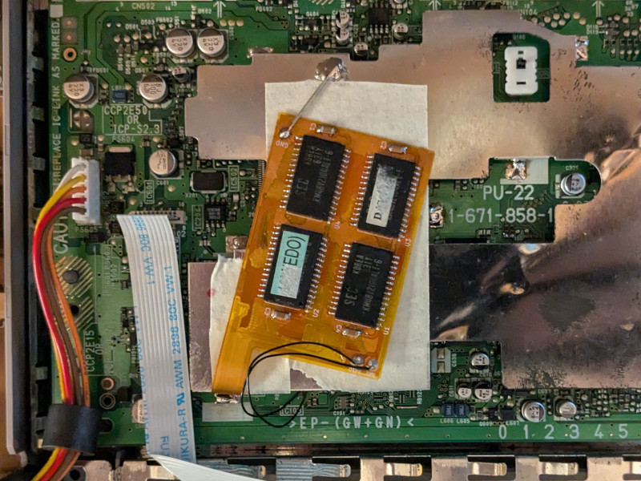

# PU22 8MB RAM Daughterboard

## DISCLAIMER

Any use of this project is **under your own responsibility**.
You will be responsible of checking the correct construction and functionality of your board.
By using this project You will agree that I cannot be held responsible if it will destroy any of your devices, damage your computer, burn down your house or whatever.

## Introduction

This daughter board replaces the single main RAM IC on your PU-22 motherboard with 4 2Mx8 ICs, shuffles some address lines and provides your PlayStation with 8MB of addressable memory.

## Hardware

The board was designed with [KiCad](https://kicad.org/) EDA.

The board **MUST** be produced on a flexible PCB!

### Installation instructions

Disassemble your PlayStation, extract the motherboard and make sure the model is a PU-22.

⚠️WARNING⚠️: This mod probably works on all units with this type of RAM and processor, but it has been tested on PU-22 units only, as of now.

Assemble the daughterboard, soldering caps and memory ICs.

Desolder the inner shield covering the main ICs, including the RAM.

Cover the components around RAM "IC106" with kapton tape, to protect them during desoldering.

Desolder the RAM IC using hot air, then clean the pads using flux and solder wick.

Solder the board to the old RAM pads, make sure to solder the board in the correct orientation. Pin one has a tiny arrow printed on it, match it on pin 1 on the motherboard.

You now need to solder two wires to the CPU, to extract A10 and A8. A10 is pin 56, A8 is pin 58.

You can then solder these lines to the pads with matching names on the daughterboard.

You can now reinstall the shield, but before inserting it, bend inward the part of the shield that went through the PCB near the RAM pad, make it almost flush to the shield, so it doesn't block the way for the daughterboard to get out.

Once reinstalled, cover the part of the shield where the daughterboard will sit with tape, so there is no chance of shorting.

Solder the daughterboard GND pad to the shield, use rigid wire so it keeps the daughterboard in place.

You can put tape over the daughterboard too, to avoid shorting, then reassemble the unit.

### Bill of Materials

| Component         | Qty | Type / Value                   | Notes                                                    |
| ----------------- | --- | ------------------------------ | -------------------------------------------------------- |
| C1 - C4           |  4  | 100nF / 1206 / ceramic         |                                                          |
| U1 - U4           |  4  | KM48V2104ALT-6                 | Compatible memory can be used                            |